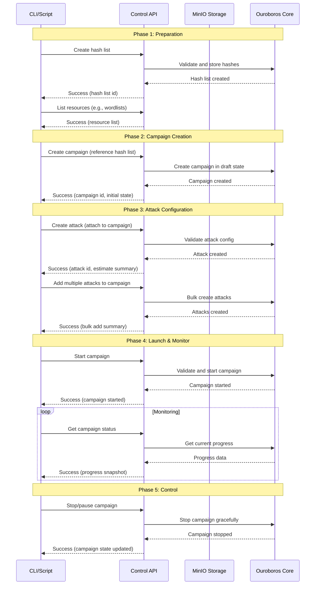
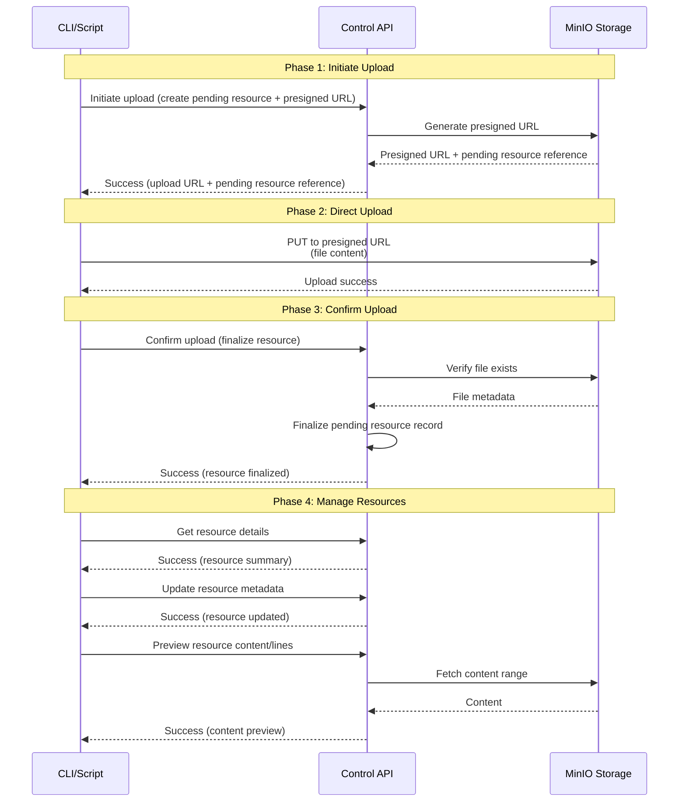
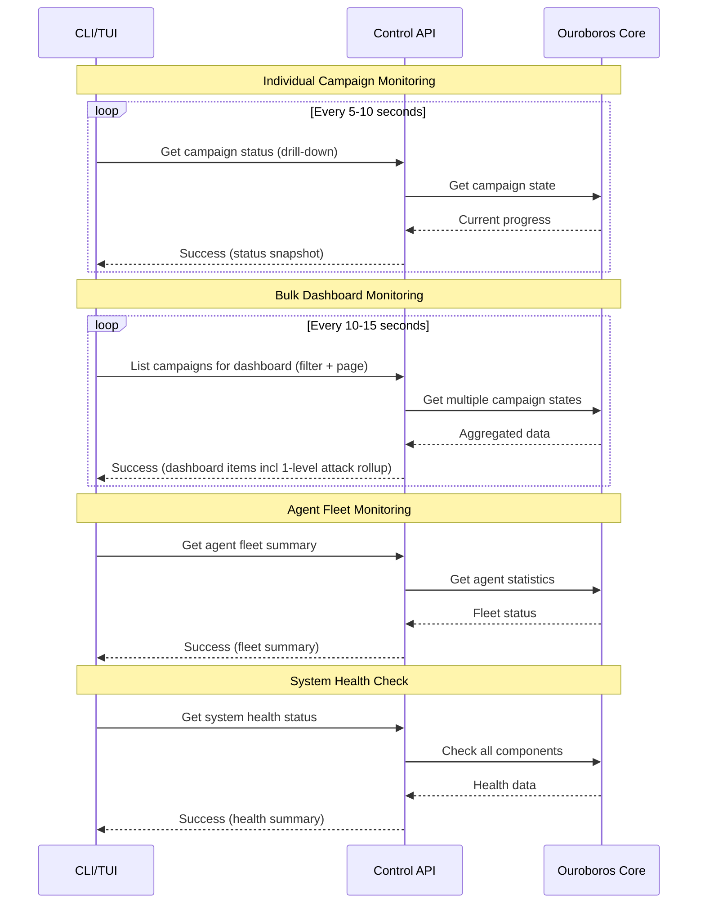

# Core Flows: Control API User Journeys

## Overview (validated)

This document defines the core user flows for the Control API as a programmatic experience for terminal users, scripts, and third-party integrations. The flows describe user intent, operation sequence, and feedback expectations; the exact endpoint design is defined later in the Tech Plan.

## Flow 1: Campaign Lifecycle Management

**Description**: Create, configure, launch, monitor, and control password cracking campaigns programmatically. Note: users invoke actions (start/stop/pause/resume/archive/unarchive) while the system reports execution states (e.g., queued/active, running, completed) that may change automatically as work progresses.

**Entry Point**: User has hash data to crack and wants to set up an automated campaign.

### Flow Steps

**Step-by-Step Breakdown**:

1. **Create hash list**: user uploads hash data and receives a hash list identifier

   - Response includes hash count, detected hash types, validation status
   - Errors indicate format issues or duplicate hashes

2. **Discover resources**: user lists available wordlists, rules, and masks in the project

   - Rich list response includes file sizes, line counts, last modified dates
   - Filtering by type, project, and search terms

3. **Create Campaign**: User creates campaign referencing hash list ID

   - Campaign starts in "draft" state, not yet executable
   - Response includes campaign ID and initial metadata

4. **Configure attacks** (two approaches):

   - **Separate**: create attacks and attach them to the campaign
   - **Inline**: include attacks as part of a single campaign creation step
   - Each attack validated for resource availability and configuration correctness
   - Response includes estimated keyspace and time-to-completion

5. **Validate before launch** (optional): user runs a pre-flight validation/check

   - Pre-flight check identifies missing resources, invalid configs
   - Returns actionable error messages without modifying state

6. **Start Campaign**: User initiates campaign execution

   - State transitions from "draft" to "running"
   - Tasks automatically distributed to available agents
   - Response confirms start time and initial task count

7. **Monitor progress**: user polls status operations (single campaign and bulk dashboard views)

   - Individual campaign status: detailed progress, active tasks, errors
   - Bulk status: monitor multiple campaigns for dashboard views
   - Rich response includes progress percentage, ETA, crack count

8. **Control Execution**: User can pause, resume, or stop campaigns

   - State transitions validated (can't start already-running campaign)
   - Graceful shutdown ensures task completion before stopping
   - Response confirms new state and timestamp

**Exit Points**:

- Campaign completes successfully -> User retrieves results (hash list is canonical, plus campaign-centric summaries/exports)
- Campaign paused -> User can resume or modify configuration
- Campaign fails -> User reviews errors and relaunches

---

## Flow 2: Resource Management

**Description**: Upload, organize, and manage attack resources (wordlists, rules, masks) for use in campaigns.

**Entry Point**: User has custom wordlists or rules to use in attacks.

### Flow Steps

**Step-by-Step Breakdown**:

1. **Initiate upload**: user provides resource metadata and receives a presigned upload URL

   - System creates a pending resource record immediately
   - Response provides a stable reference used for confirmation/finalization

2. **Upload to Storage**: User uploads file directly to MinIO

   - Uses presigned URL from step 1
   - No API server involvement (better performance for large files)
   - Standard HTTP PUT with file content

3. **Confirm upload**: user finalizes the pending resource

   - System verifies file exists in storage
   - System validates and analyzes the file (e.g., line count)
   - Response confirms the resource is finalized and ready for use

4. **List Resources**: User discovers available resources

   - Rich list includes file sizes, line counts, creation dates
   - Filtering by type, project, search terms
   - Pagination for large resource libraries

5. **View Resource Details**: User inspects specific resource

   - Full metadata including usage statistics
   - Preview of content (first N lines)
   - Associated campaigns/attacks using this resource

6. **Update Resource**: User modifies resource metadata or content

   - Rename, change description, update tags
   - Inline content editing for small files
   - Versioning for content changes

7. **Delete Resource**: User removes unused resource

   - Validation prevents deletion if resource is in use
   - Soft delete with recovery period
   - Cascade options for associated data

**Exit Points**:

- Resource ready for use in attacks
- Resource deleted or archived
- Upload failed -> User retries with new presigned URL

---

## Flow 3: Real-Time Monitoring & Status Polling

**Description**: Monitor campaign progress, agent status, and system health through efficient polling patterns.

**Entry Point**: User has running campaigns and wants to track progress.

### Flow Steps

**Step-by-Step Breakdown**:

1. **Individual Campaign Status**: User polls single campaign

   - Detailed progress: percentage complete, ETA, current attack
   - Active task count and agent assignments
   - Recent crack count and error count
   - Optimized for focused monitoring

2. **Bulk campaign status**: user monitors multiple campaigns in a single dashboard query

   - Filterable and pageable
   - Rich-but-shallow campaign rollups
   - Includes a 1-level attack rollup summary (e.g., current attack + next attack)

3. **Campaign Metrics**: User retrieves performance data

   - Hash rate over time
   - Crack rate and success percentage
   - Resource utilization per attack
   - Historical trend data

4. **Agent Fleet Summary**: User monitors agent availability

   - Total agents, active/idle breakdown
   - Hardware capabilities summary
   - Error rates and performance metrics
   - Filtering by project assignment

5. **System Health**: User checks overall system status

   - Component health (database, storage, queue)
   - Resource usage (CPU, memory, disk)
   - Active connections and throughput
   - Alert conditions and warnings

**Polling guidance (examples)**:

- Individual status: 5-10 second intervals
- Bulk status: 10-15 second intervals
- System health: 30-60 second intervals
- Clients should back off on errors (e.g., exponential backoff)

**Exit Points**:

- Campaign completes -> Stop polling, retrieve results
- User stops monitoring -> Continue background execution
- System issues detected -> User investigates via drill-down operations

---

## Flow 4: Template reuse (export, validate, import)

**Description**: Export campaign configurations as templates and import them into other environments.

**Entry Point**: User wants to reuse campaign configuration across projects or environments.

### Flow Steps

1. **Export Campaign Template**: User exports existing campaign

   - Includes all attacks, configurations, resource references
   - Template format: JSON with schema version
   - Resource references use GUIDs for portability

2. **Validate Template**: User validates template before import

   - Dry-run mode checks resource availability
   - Identifies missing resources and incompatibilities
   - Returns detailed validation report

3. **Import template**: user imports the template into the target environment

   - Partial import is allowed: create the campaign but skip attacks with missing resources
   - Response clearly reports imported vs skipped items and why

4. **Resolve Missing Resources**: User uploads missing resources

   - Identifies required resources from validation report
   - Uploads via resource management flow
   - Re-imports template after resources available

5. **Customize Imported Campaign**: User modifies imported configuration

   - Updates campaign name, description
   - Adjusts attack parameters
   - Assigns to different project or hash list

**Exit Points**:

- Template successfully imported -> Campaign ready to launch
- Partial import -> User resolves missing resources
- Import failed -> User reviews validation errors

---

## Flow 5: Batch Operations

**Description**: Perform bulk operations on multiple campaigns for efficient management. Batch operations are intentionally **single-project scoped** (one project per request).

**Entry Point**: User needs to control multiple campaigns simultaneously within a project.

### Flow Steps

1. **Bulk start campaigns**: user starts multiple campaigns

   - Default behavior is best-effort (per-item outcomes)
   - User may request atomic behavior when needed
   - Response includes success/failure for each campaign

2. **Bulk Stop Campaigns**: User stops multiple campaigns

   - Same atomic vs best-effort choice
   - Graceful shutdown for all campaigns
   - Response includes final states

3. **Bulk Status Check**: User retrieves status for multiple campaigns

   - Efficient single API call vs multiple individual calls
   - Filtering and pagination support
   - Rich data for dashboard rendering

4. **Bulk Delete/Archive**: User removes multiple campaigns

   - Validation prevents deletion of running campaigns
   - Cascade options for associated data
   - Response includes deletion results

**Batch Operation Modes**:

- **Atomic**: All operations succeed or all fail (transaction-like)
- **Best-Effort**: Process each independently, return partial results
- **Configurable**: user chooses between best-effort and atomic behavior

**Exit Points**:

- All operations successful -> User continues workflow
- Partial success -> User reviews failures and retries
- All operations failed -> User investigates root cause

---

## Flow 6: Error Recovery & Validation

**Description**: Discover and resolve issues before and after operations.

**Entry Point**: User wants to ensure operation will succeed or understand why it failed.

### Flow Steps

1. **Pre-Flight Validation**: User validates before attempting operation

   - Campaign start validation: checks resources, agents, hash list
   - Attack creation validation: checks resource availability, config correctness
   - Returns detailed validation report without modifying state

2. **Operation Attempt**: User attempts operation

   - Operation fails with RFC9457 error response
   - Error includes problem type, detail, and suggested fixes
   - Instance URI points to specific resource

3. **Error Analysis**: User examines error details

   - Problem type indicates category (missing resource, invalid config, etc.)
   - Detail provides human-readable explanation
   - Extensions include actionable suggestions

4. **Issue Resolution**: User fixes identified problems

   - Uploads missing resources
   - Corrects configuration errors
   - Assigns required permissions

5. **Retry Operation**: User retries after fixes

   - Validation endpoint confirms fixes
   - Operation succeeds
   - User continues workflow

**Error response expectations (RFC9457)**:

- Errors are returned as Problem Details (machine-readable type plus human-readable title/detail).
- Responses may include extensions to support automation (e.g., a list of missing resources and suggested next actions).

**Exit Points**:

- Validation passes -> User proceeds with operation
- Validation fails -> User resolves issues
- Operation succeeds after fixes -> User continues workflow

---

## Flow 7: Administration (users, projects, API keys)

**Description**: Headless administration for operators and system administrators.

**Entry Point**: Admin needs to manage access and operational setup without using the Web UI.

**Flow Steps**:

1. Admin lists and manages projects (create/update/archive/delete where permitted).
2. Admin lists and manages users (create/update/deactivate) and their project access.
3. Admin manages API keys (create/rotate/revoke) and can audit key usage at a high level.

**Exit Points**:

- Admin changes applied -> projects/users/keys ready for campaign workflows

---

## Cross-Flow Patterns

### Authentication

- All flows require API key authentication
- Token format: `cst_<user_id>_<random_string>`
- Passed via `Authorization: Bearer <token>` header
- Invalid/expired tokens return 401 Unauthorized

### Project scoping

- **Default scoping:** clients scope most operations via a `project_id` query parameter (or omit it to operate over “all accessible projects” for list-style endpoints).
- **Deliberate hybrid:** batch campaign operations are scoped by project in the URL hierarchy (single project per batch request) to reduce cross-project mistakes.
- Operations are constrained to projects the caller can access.
- Admin workflows may support cross-project views where permitted.

### Pagination

- Offset-based pagination for list operations.
- Responses include returned items, total count, and paging metadata.
- Designed for sequential access and TUI rendering.

### Rate limiting (guidance)

- Rate limiting may be enforced to protect system stability.
- Any rate limiting and caching behavior should be compatible with scripts and provide clear feedback.

### Data Richness

- List operations return rich data (not deeply nested)
- Includes computed fields: progress, ETA, crack count
- Nested relationships limited to 1 level deep
- Drill-down operations provide full depth when needed

---

## Success Metrics

These flows are successful when:

1. **Workflow Completeness**: Users can complete entire campaign lifecycle without Web UI
2. **Automation Efficiency**: Bulk operations significantly faster than manual Web UI clicks
3. **Integration Reliability**: Third-party tools can build stable integrations
4. **Error Clarity**: Users can diagnose and fix issues from error responses alone
5. **Performance**: Polling patterns don't overload API or database
