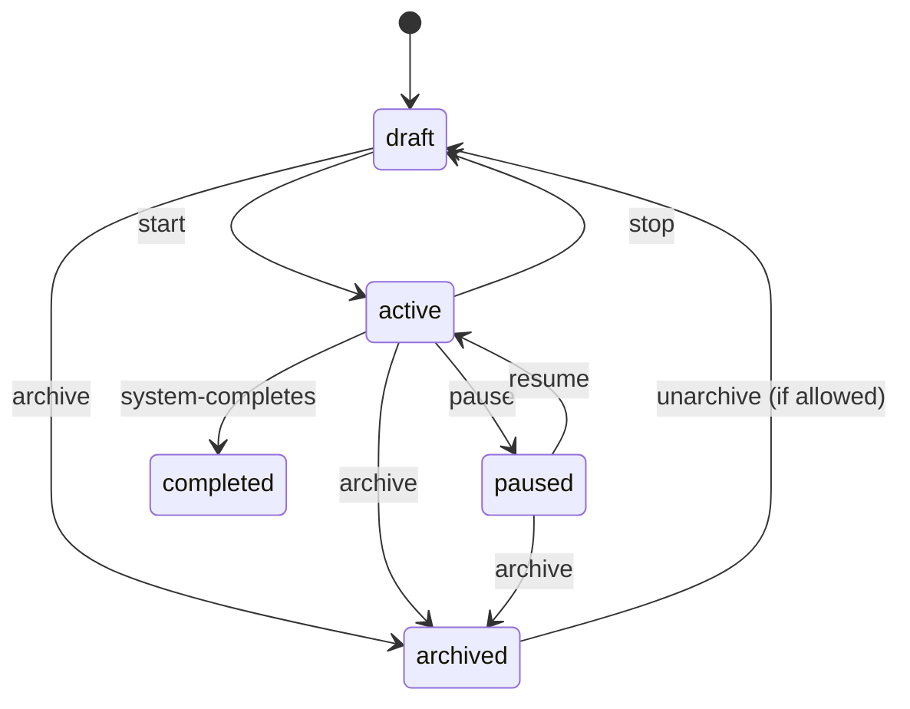

# Tech Plan: Control API Completion

## Architectural Approach

**Goal:** Complete `/api/v1/control/*` for headless administration + automation-first operations (campaigns/resources/monitoring/results), reusing the existing service layer while enforcing machine-friendly behavior (offset pagination, strict state transitions, RFC9457).

### API shape & scoping

- **Default project scoping:** **query-parameter scoping** (matches existing Control API patterns in `file:app/api/v1/endpoints/control/campaigns.py`).
  - List endpoints: `project_id` optional; when omitted, results are limited to projects visible via `current_user.project_associations`.
  - Mutating endpoints: `project_id` is required (or implied by the referenced resource), and must pass `user_can_access_project_by_id(...)` from `file:app/core/authz.py`.
- **Batch operations scoping (deliberate hybrid):** batch endpoints are **path-scoped by project** to reduce accidental cross-project actions and to simplify caching / audit logs. Example shape: `/api/v1/control/projects/{project_id}/campaigns/batch-*`.
- **Admin surfaces** (users/projects/keys) remain non-project-scoped.

### AuthN/AuthZ

- AuthN: `get_current_control_user` (`file:app/core/deps.py`) using `Authorization: Bearer cst_<user_id>_<random>`.
- AuthZ: Casbin enforcement via `user_can(...)` + project membership checks via `user_can_access_project_by_id(...)`.

### RFC9457 error handling (non-negotiable)

- **Normalization approach (validated):** Control routes may call into existing services that raise `HTTPException` (common across the codebase). For the Control API, those exceptions must be normalized into RFC9457.
- **Implementation strategy:** extend `file:app/core/control_rfc9457_middleware.py` to also intercept `fastapi.HTTPException` on `/api/v1/control/*` paths and emit an RFC9457 Problem response (using `about:blank` or a stable internal problem type set). This keeps changes localized and avoids a wide service-layer refactor.
- Endpoints still translate known domain failures into `file:app/core/control_exceptions.py` Problem types.
- Problem responses should support **extensions** (e.g., missing resources list) in addition to `type/title/status/detail/instance`.

### Strict lifecycle state machines

- Implement dedicated state machine classes (Campaign + Attack) and enforce them in service-layer operations (start/stop/pause/resume/archive/unarchive).
- Persisted states use existing enums (e.g., `CampaignState` in `file:app/models/campaign.py`).
- “Running” vs “Queued” should be treated as **derived runtime status** (computed from tasks/attacks) rather than requiring a new DB enum immediately.

### Resource uploads (pending → confirm)

- Use the existing “create pending + presign” approach in `file:app/core/services/resource_service.py`:
  - Initiate returns a stable pending resource reference + presigned PUT URL.
  - Confirm finalizes: verifies object exists, computes stats/checksum (via `StorageService.get_file_stats` in `file:app/core/services/storage_service.py`), sets `is_uploaded=True`.
- Cleanup (deterministic):
  - Manual cancel endpoint is supported.
  - Implement a **periodic sweep** (idempotent) that:
    1. finds stale pending resources (e.g., `is_uploaded=false` older than a cutoff),
    2. checks MinIO object presence,
    3. deletes DB record and object when appropriate.
  - The sweep must open fresh DB sessions via `file:app/db/session.py` (not reuse request sessions) and be safe under concurrency (multiple workers) by using row-level locking or other idempotent guards.
  - The existing timeout-based background check in `file:app/core/tasks/resource_tasks.py` can remain as a fast-path, but the sweep is the reliability backstop.

### Monitoring & dashboard endpoints

- “Bulk dashboard” endpoints return **rich-but-shallow** campaign rollups plus **1-level attack rollup** (current + next).
- Bulk status is cached for **5–10 seconds TTL**, **shared by project** (cache key includes `project_id` + normalized filters).

### Batch operations

- Batch operations are **single-project scoped**.
- Default mode is **best-effort** (per-item outcomes); optional `mode=atomic`.
- Response is an **array of per-item results** with `success` and a machine-readable error payload when failed.

### Templates

- Templates are **JSON** with explicit `schema_version` (reuse `CampaignTemplate` from `file:app/schemas/shared.py`).
- Import endpoint supports `validate_only=true`.
- Import supports **partial import**: campaign created, but attacks referencing missing resources are skipped with a structured report.

### Results retrieval & exports

- Results are canonical at the HashList/HashItem layer (`file:app/models/hash_list.py`, `file:app/models/hash_item.py`) plus campaign convenience views.
- Campaign results support:
  - JSON (API-native),
  - CSV (common tooling),
  - Hashcat potfile format (integration-friendly).

---

## Data Model

### Reuse existing entities (no new tables preferred)

- Campaign (`file:app/models/campaign.py`)
- Attack (`file:app/models/attack.py`)
- Task (`file:app/models/task.py`)
- Agent (`file:app/models/agent.py`)
- HashList/HashItem (`file:app/models/hash_list.py`, `file:app/models/hash_item.py`)
- Resources (`file:app/models/attack_resource_file.py`)
- CrackResult (`file:app/models/crack_result.py`)

### Planned additions / changes (decision-sensitive)

- **Control API keys:** keep the current **single key per user** model for this Epic (`User.api_key` in `file:app/models/user.py`). Multi-key support is explicitly deferred.
- **Pending resource cleanup:** avoid schema changes by using `AttackResourceFile.created_at` + `is_uploaded=False` to identify stale pending records for deterministic periodic sweep cleanup.

---

## Component Architecture

### API layer (Control routers)

- Keep routers thin: auth, scoping, pagination normalization, error translation.
- Primary Control domains:
  - Admin: users, projects, API keys
  - Operational: campaigns, attacks, agents, tasks, resources, hash-lists
  - “Convenience” workflows: templates, results, batch operations, monitoring

### Service layer strategy (codebase fit)

- Prefer reuse of existing services in `file:app/core/services/`:
  - `campaign_service`, `attack_service`, `agent_service`, `task_service`, `hash_list_service`, `resource_service`, `storage_service`
- Add minimal “Control adapters” where needed to:
  - convert page-based results to offset-based responses,
  - translate `HTTPException` / generic exceptions into RFC9457 Problem types,
  - enforce state machine transitions consistently.

### Background/maintenance components

- Resource pending cleanup should not reuse request-scoped DB sessions; background operations must open fresh sessions via the global session manager (`file:app/db/session.py`).
