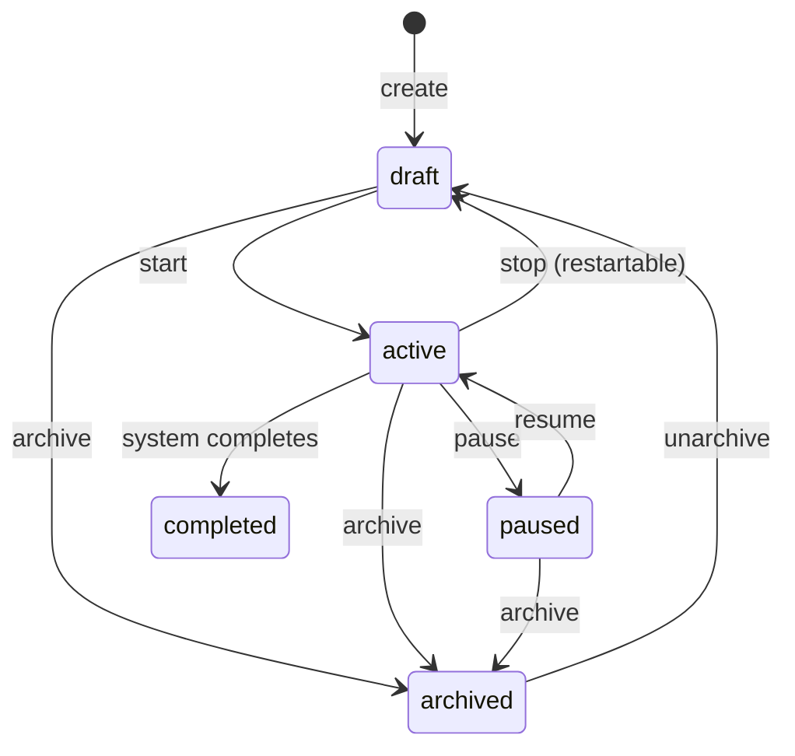

# Campaign Lifecycle Actions

## Overview

Implement Control API endpoints for campaign lifecycle operations: start, stop, pause, resume, archive, and unarchive. These operations control campaign execution and are validated by state machines.

## Context

Campaign lifecycle management is core to the Control API workflow. Users need to start campaigns, pause them for resource management, stop them when complete, and archive them for cleanup. All state transitions must be validated to ensure data integrity.

**Spec References:**

- `spec:84e8066f-28f2-4489-aeb6-0aeceb19dcde/d3caa175-100a-4242-b8b4-0c8139a48034` (Core Flows - Flow 1: Campaign Lifecycle, Steps 6-8)
- `spec:84e8066f-28f2-4489-aeb6-0aeceb19dcde/874b33d9-e442-4af3-98d3-e08cb71a007c` (Tech Plan - State Machines)

## Scope

**In Scope:**

- Campaign start endpoint with state validation
- Campaign stop endpoint (restartable, returns to draft)
- Campaign pause endpoint
- Campaign resume endpoint
- Campaign archive/unarchive endpoints
- Integration with state machine from T2
- Integration with existing `file:app/core/services/campaign_service.py`

**Out of Scope:**

- Campaign CRUD (handled in T7)
- Campaign monitoring (handled in T11)
- Batch operations (handled in T14)

## Implementation Guidance



**Endpoints:**

- `POST /api/v1/control/campaigns/{id}/start` - Start campaign
- `POST /api/v1/control/campaigns/{id}/stop` - Stop campaign (restartable)
- `POST /api/v1/control/campaigns/{id}/pause` - Pause campaign
- `POST /api/v1/control/campaigns/{id}/resume` - Resume campaign
- `POST /api/v1/control/campaigns/{id}/archive` - Archive campaign
- `POST /api/v1/control/campaigns/{id}/unarchive` - Unarchive campaign

**Key Files:**

- `file:app/api/v1/endpoints/control/campaigns.py` - Add lifecycle endpoints
- `file:app/core/services/campaign_service.py` - Existing lifecycle services
- `file:app/core/state_machines.py` - State machine validation (from T2)
- `file:app/models/campaign.py` - Campaign model

**Lifecycle Action Pattern:**

```python
@router.post("/{campaign_id}/start")
async def start_campaign(
    campaign_id: int,
    db: AsyncSession = Depends(get_db),
    current_user: User = Depends(get_current_control_user),
):
    campaign = await get_campaign_service(db, campaign_id)

    # Validate state transition
    CampaignStateMachine.validate_transition(campaign.state, CampaignState.ACTIVE)

    # Perform lifecycle action
    updated_campaign = await start_campaign_service(db, campaign_id)
    return updated_campaign
```

## Acceptance Criteria

- [ ] Users can start campaigns (draft → active)
- [ ] Users can stop campaigns (active → draft, restartable)
- [ ] Users can pause campaigns (active → paused)
- [ ] Users can resume campaigns (paused → active)
- [ ] Users can archive campaigns (any state → archived)
- [ ] Users can unarchive campaigns (archived → draft)
- [ ] All state transitions are validated by `CampaignStateMachine`
- [ ] Invalid transitions return RFC9457 errors with clear messages
- [ ] Lifecycle actions respect project scoping
- [ ] Start action validates resources and agents availability
- [ ] Stop action performs graceful shutdown (completes running tasks)

## Testing Strategy

**Backend Tests (Tier 1):**

- Test all lifecycle actions with valid state transitions
- Test invalid state transitions (expect errors)
- Test start validation (missing resources, no agents)
- Test graceful stop (task completion)
- Test project scoping

**Test Command:** `just test-backend`

## Dependencies

- `ticket:84e8066f-28f2-4489-aeb6-0aeceb19dcde/T2` (State Machine Classes) - Required for validation
- `ticket:84e8066f-28f2-4489-aeb6-0aeceb19dcde/T7` (Campaign CRUD) - Required for campaign data

## Related Tickets

- Required by `ticket:84e8066f-28f2-4489-aeb6-0aeceb19dcde/T14` (Results & Batch Operations)
