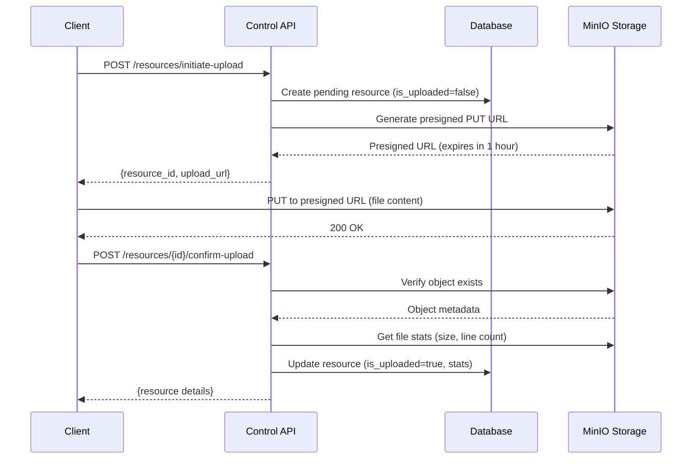

# Presigned Upload Workflow

## Overview

Implement the 2-step presigned upload workflow for resource files: initiate (create pending resource + presigned URL) and confirm (verify and finalize resource). This enables efficient direct-to-storage uploads without proxying through the API server.

## Context

Large resource files (wordlists, rules) should be uploaded directly to MinIO storage for performance. The Control API provides presigned URLs for direct upload, then confirms the upload to finalize the resource record.

**Spec References:**

- `spec:84e8066f-28f2-4489-aeb6-0aeceb19dcde/d3caa175-100a-4242-b8b4-0c8139a48034` (Core Flows - Flow 2: Resource Management, Steps 1-3)
- `spec:84e8066f-28f2-4489-aeb6-0aeceb19dcde/874b33d9-e442-4af3-98d3-e08cb71a007c` (Tech Plan - Resource Uploads)

## Scope

**In Scope:**

- Upload initiate endpoint (create pending resource + presigned URL)
- Upload confirm endpoint (verify and finalize resource)
- Integration with existing `file:app/core/services/resource_service.py`
- Integration with `file:app/core/services/storage_service.py`
- Pending resource visibility in list operations

**Out of Scope:**

- Direct file upload to API (using presigned URLs only)
- Resource content editing
- Multi-part upload support

## Implementation Guidance



**Endpoints:**

- `POST /api/v1/control/resources/initiate-upload` - Initiate upload
- `POST /api/v1/control/resources/{id}/confirm-upload` - Confirm upload

**Key Files:**

- `file:app/api/v1/endpoints/control/resources.py` - Add endpoints
- `file:app/core/services/resource_service.py` - Existing presign logic
- `file:app/core/services/storage_service.py` - Presigned URL generation
- `file:app/models/attack_resource_file.py` - Resource model

**Initiate Response:**

```python
{
    "resource_id": 789,
    "upload_url": "https://minio.example.com/bucket/file?signature=...",
    "expires_at": "2024-01-15T11:30:00Z",
}
```

## Acceptance Criteria

- [ ] Users can initiate upload and receive presigned URL + pending resource ID
- [ ] Pending resource is created immediately with `is_uploaded=false`
- [ ] Presigned URL expires after 1 hour
- [ ] Users can upload directly to MinIO using presigned URL
- [ ] Users can confirm upload to finalize resource
- [ ] Confirm endpoint verifies file exists in storage
- [ ] File stats (size, line count, checksum) are computed on confirm
- [ ] Confirmed resource has `is_uploaded=true`
- [ ] Pending resources are visible in list operations (marked as pending)
- [ ] All errors follow RFC9457 format

## Testing Strategy

**Backend Tests (Tier 1):**

- Test initiate endpoint (mock MinIO presigned URL generation)
- Test confirm endpoint (mock MinIO object verification)
- Test file stats computation
- Test error cases (file not found, invalid resource ID)
- Test pending resource visibility

**Test Command:** `just test-backend`

## Dependencies

- Soft dependency on `ticket:84e8066f-28f2-4489-aeb6-0aeceb19dcde/T3` (Resource Cleanup Job) for cleanup integration

## Related Tickets

- Complements `ticket:84e8066f-28f2-4489-aeb6-0aeceb19dcde/T5` (Resource File CRUD)
