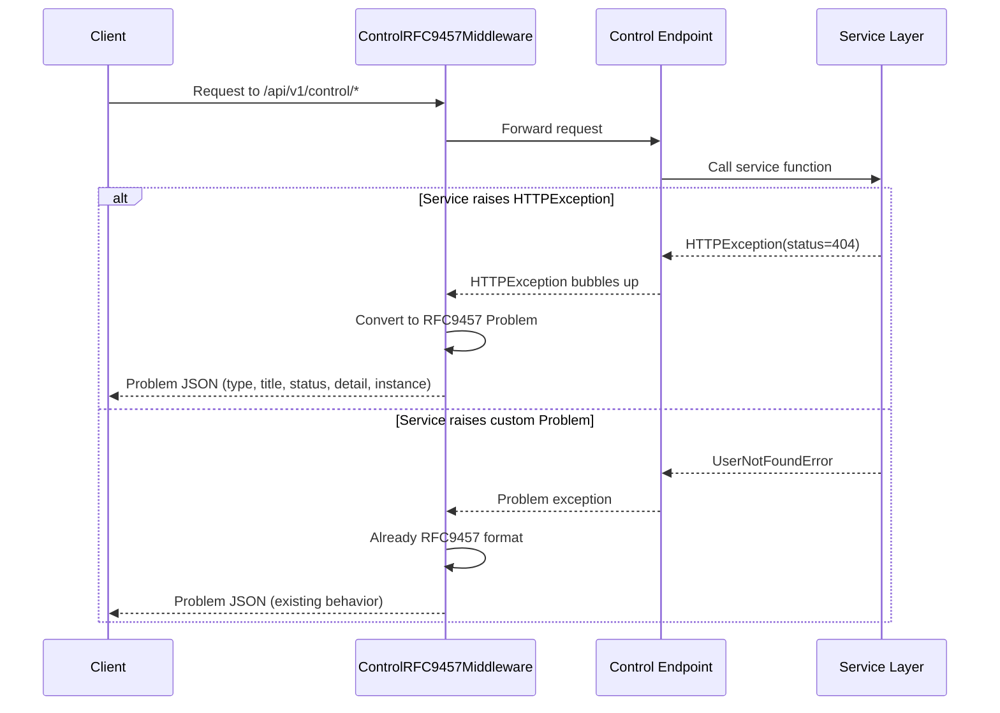

# RFC9457 Middleware Extension

## Overview

Extend the existing RFC9457 middleware to normalize all `HTTPException` instances into RFC9457 Problem responses for Control API endpoints. This ensures consistent, machine-readable error responses across the entire Control API surface.

## Context

The Control API currently uses `file:app/core/control_rfc9457_middleware.py` to handle custom Problem exceptions. However, many service layer functions raise standard `fastapi.HTTPException`, which bypasses RFC9457 formatting. This creates inconsistent error responses that break the Control API contract.

**Spec References:**

- `spec:84e8066f-28f2-4489-aeb6-0aeceb19dcde/874b33d9-e442-4af3-98d3-e08cb71a007c` (Tech Plan - RFC9457 Error Handling)
- `spec:84e8066f-28f2-4489-aeb6-0aeceb19dcde/d3caa175-100a-4242-b8b4-0c8139a48034` (Core Flows - Flow 6: Error Recovery)

## Scope

**In Scope:**

- Extend `ControlRFC9457Middleware` to intercept `fastapi.HTTPException` on `/api/v1/control/*` paths
- Convert HTTPException to RFC9457 Problem responses with appropriate problem types
- Support problem extensions for actionable error details (e.g., missing resources list)
- Preserve existing behavior for custom Problem exceptions
- Add comprehensive tests for middleware behavior

**Out of Scope:**

- Service layer refactoring (keeping existing exception patterns)
- Changes to Web UI or Agent API error handling
- Custom exception classes (use existing ones from `file:app/core/control_exceptions.py`)

## Implementation Guidance



**Key Files:**

- `file:app/core/control_rfc9457_middleware.py` - Extend this middleware
- `file:app/core/control_exceptions.py` - Reference existing Problem types
- `file:app/core/services/campaign_service.py` - Example service raising HTTPException

**Middleware Extension Pattern:**

```python
# In ControlRFC9457Middleware.__call__
try:
    response = await call_next(request)
except HTTPException as exc:
    # Convert to RFC9457 Problem
    problem = {
        "type": "about:blank",  # or map to specific problem type
        "title": "HTTP Error",
        "status": exc.status_code,
        "detail": exc.detail,
        "instance": str(request.url.path),
    }
    return JSONResponse(
        status_code=exc.status_code,
        content=problem,
        headers={"Content-Type": "application/problem+json"},
    )
```

## Acceptance Criteria

- [ ] All `HTTPException` raised on `/api/v1/control/*` paths return RFC9457 format
- [ ] Problem responses include required fields: `type`, `title`, `status`, `detail`, `instance`
- [ ] Problem extensions are supported (e.g., `missing_resources` array)
- [ ] Existing custom Problem exceptions continue to work unchanged
- [ ] Middleware does not affect `/api/v1/web/*` or `/api/v1/client/*` paths
- [ ] Tests cover HTTPException conversion for common status codes (400, 401, 403, 404, 500)
- [ ] Tests verify existing Problem exception behavior is preserved

## Testing Strategy

**Backend Tests (Tier 1):**

- Unit tests for middleware conversion logic
- Integration tests with actual Control API endpoints
- Verify RFC9457 format compliance for all error responses
- Test problem extensions (e.g., validation errors with field details)

**Test Command:** `just test-backend`

## Dependencies

None - this is foundation work that can start immediately.

## Related Tickets

- Enables all other Control API tickets by ensuring consistent error handling
