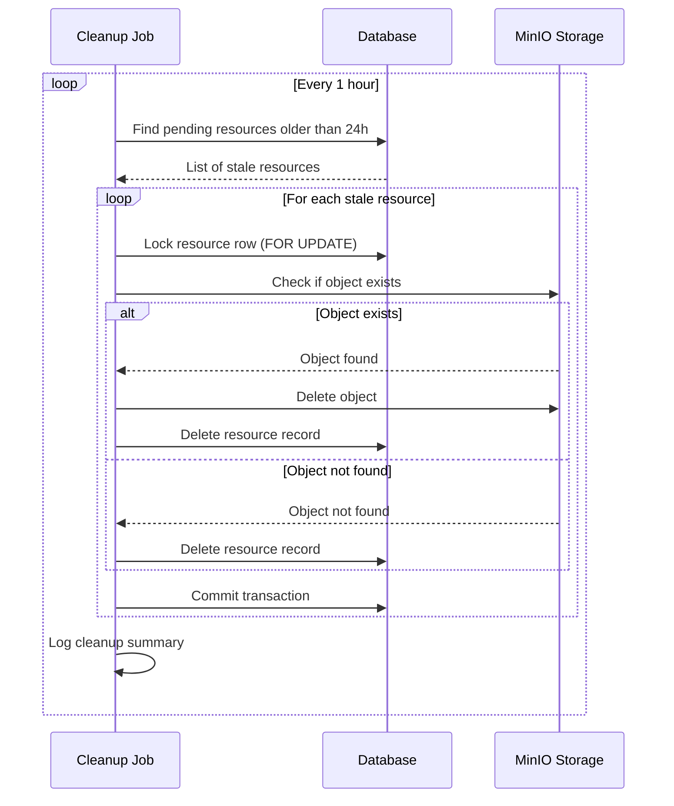

# Resource Cleanup Job

## Overview

Implement a deterministic periodic sweep job to clean up stale pending resources that were never confirmed after upload initiation. This ensures storage hygiene and prevents abandoned uploads from accumulating.

## Context

The presigned upload workflow creates pending resource records immediately. If users never confirm the upload (network failure, client crash, etc.), these pending records remain indefinitely. A periodic cleanup job is needed to remove stale pending resources.

**Spec References:**

- `spec:84e8066f-28f2-4489-aeb6-0aeceb19dcde/874b33d9-e442-4af3-98d3-e08cb71a007c` (Tech Plan - Resource Cleanup)
- `spec:84e8066f-28f2-4489-aeb6-0aeceb19dcde/d3caa175-100a-4242-b8b4-0c8139a48034` (Core Flows - Flow 2: Resource Management)

## Scope

**In Scope:**

- Create periodic sweep job for stale pending resources (24hr+ old)
- Implement idempotent cleanup logic with row-level locking
- Add manual cancel endpoint for immediate cleanup
- Use fresh DB sessions (not request-scoped)
- Add monitoring/logging for cleanup operations
- Integration with existing `file:app/core/tasks/resource_tasks.py`

**Out of Scope:**

- Real-time cleanup (periodic sweep is sufficient)
- Cleanup of confirmed resources (only pending)
- Storage quota enforcement

## Implementation Guidance



**Key Files:**

- `file:app/core/tasks/resource_tasks.py` - Extend with cleanup job
- `file:app/core/services/resource_service.py` - Add cancel endpoint logic
- `file:app/db/session.py` - Use for fresh DB sessions
- `file:app/models/attack_resource_file.py` - Resource model

**Cleanup Job Pattern:**

```python
async def cleanup_stale_pending_resources():
    """Periodic job to clean up pending resources older than 24 hours."""
    async with get_async_session() as db:  # Fresh session
        cutoff = datetime.now(UTC) - timedelta(hours=24)
        
        # Find stale pending resources with row lock
        stmt = (
            select(AttackResourceFile)
            .where(
                AttackResourceFile.is_uploaded == False,
                AttackResourceFile.created_at < cutoff
            )
            .with_for_update()
        )
        result = await db.execute(stmt)
        stale_resources = result.scalars().all()
        
        for resource in stale_resources:
            # Delete from storage if exists
            # Delete from database
            # Log cleanup
```

## Acceptance Criteria

- [ ] Periodic job runs every hour to clean up stale pending resources
- [ ] Job finds resources with `is_uploaded=False` older than 24 hours
- [ ] Cleanup is idempotent (safe to run multiple times)
- [ ] Row-level locking prevents concurrent cleanup conflicts
- [ ] Job uses fresh DB sessions via `file:app/db/session.py`
- [ ] Manual cancel endpoint allows immediate cleanup of specific resources
- [ ] Cleanup operations are logged with structured data (resource ID, age, outcome)
- [ ] Job handles errors gracefully (continues on individual failures)

## Testing Strategy

**Backend Tests (Tier 1):**

- Unit tests for cleanup logic
- Test idempotency (running cleanup multiple times)
- Test concurrency safety (multiple workers)
- Test manual cancel endpoint
- Mock MinIO storage interactions

**Test Command:** `just test-backend`

## Dependencies

None - this is foundation work that can start immediately.

## Related Tickets

- Soft dependency for `ticket:84e8066f-28f2-4489-aeb6-0aeceb19dcde/T6` (Presigned Upload Workflow)
