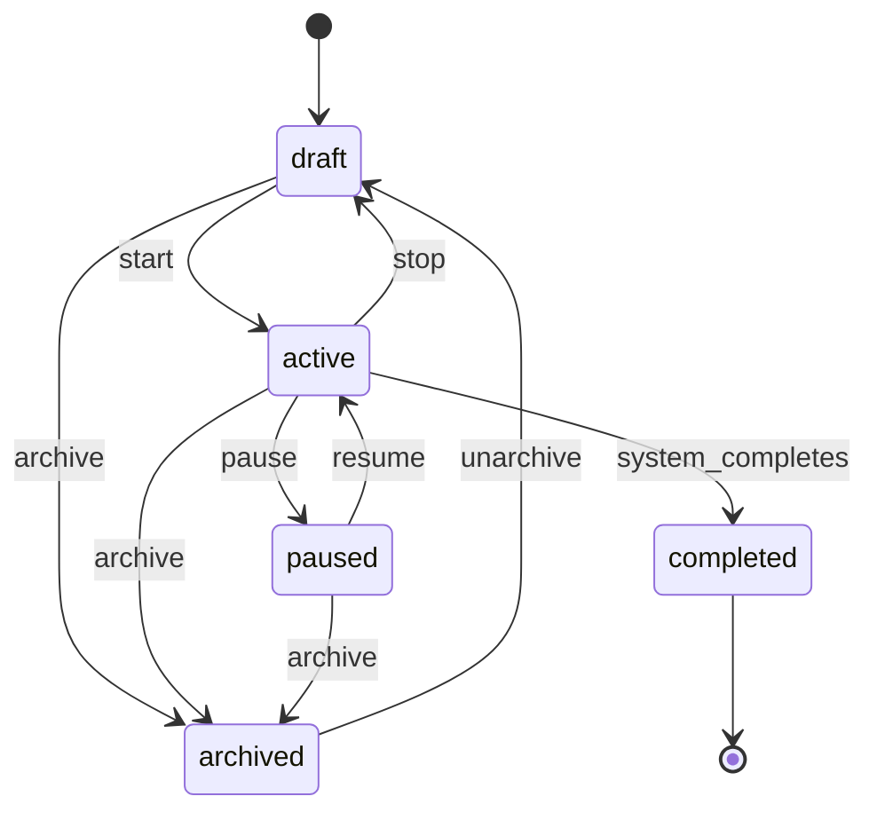

# State Machine Classes

## Overview

Implement dedicated state machine classes for Campaign and Attack lifecycle management. These classes enforce valid state transitions and provide clear error messages for invalid operations, ensuring data integrity and predictable behavior.

## Context

Campaigns and attacks have complex lifecycles with specific valid transitions. Currently, state transitions are validated ad-hoc in service functions, leading to inconsistent behavior and unclear error messages. Dedicated state machine classes centralize this logic and make it reusable.

**Spec References:**

- `spec:84e8066f-28f2-4489-aeb6-0aeceb19dcde/874b33d9-e442-4af3-98d3-e08cb71a007c` (Tech Plan - State Machines)
- `spec:84e8066f-28f2-4489-aeb6-0aeceb19dcde/d3caa175-100a-4242-b8b4-0c8139a48034` (Core Flows - Flow 1: Campaign Lifecycle)

## Scope

**In Scope:**

- Create `CampaignStateMachine` class with transition validation
- Create `AttackStateMachine` class with transition validation
- Define valid state transitions for both entities
- Add state transition validation utilities
- Comprehensive tests for all state transitions

**Out of Scope:**

- Database schema changes (use existing `CampaignState` enum)
- Service layer integration (handled in lifecycle tickets)
- UI state representation

## Implementation Guidance



**Campaign State Machine:**

- **States:** draft, active, paused, completed, archived
- **User Actions:** start, stop, pause, resume, archive, unarchive
- **System Transitions:** active → running (when tasks execute), running → completed (when all attacks finish)

**Attack State Machine:**

- **States:** pending, running, paused, completed, failed
- **User Actions:** start, stop, pause, resume
- **System Transitions:** pending → running (when assigned to agent), running → completed (when finished)

**Key Files:**

- Create `file:app/core/state_machines.py` - New file for state machine classes
- Reference `file:app/models/campaign.py` - Existing CampaignState enum
- Reference `file:app/models/attack.py` - Existing Attack model

**State Machine Pattern:**

```python
class CampaignStateMachine:
    TRANSITIONS = {
        CampaignState.DRAFT: [CampaignState.ACTIVE, CampaignState.ARCHIVED],
        CampaignState.ACTIVE: [
            CampaignState.PAUSED,
            CampaignState.DRAFT,
            CampaignState.ARCHIVED,
        ],
        CampaignState.PAUSED: [CampaignState.ACTIVE, CampaignState.ARCHIVED],
        # ...
    }

    @classmethod
    def can_transition(cls, from_state: CampaignState, to_state: CampaignState) -> bool:
        return to_state in cls.TRANSITIONS.get(from_state, [])

    @classmethod
    def validate_transition(
        cls, from_state: CampaignState, to_state: CampaignState
    ) -> None:
        if not cls.can_transition(from_state, to_state):
            raise InvalidStateTransitionError(
                f"Cannot transition from {from_state} to {to_state}"
            )
```

## Acceptance Criteria

- [ ] `CampaignStateMachine` enforces valid transitions (draft→active, active→paused, etc.)
- [ ] `AttackStateMachine` enforces valid transitions
- [ ] Invalid transitions raise `InvalidStateTransitionError` with clear messages
- [ ] State machines distinguish between user actions and system transitions
- [ ] State machines are reusable across service layer
- [ ] Comprehensive test coverage for all valid and invalid transitions
- [ ] Documentation includes state transition diagrams

## Testing Strategy

**Backend Tests (Tier 1):**

- Unit tests for each state machine class
- Test all valid transitions
- Test all invalid transitions (expect errors)
- Test edge cases (e.g., transitioning from same state to same state)

**Test Command:** `just test-backend`

## Dependencies

None - this is foundation work that can start immediately.

## Related Tickets

- Required by `ticket:84e8066f-28f2-4489-aeb6-0aeceb19dcde/T8` (Campaign Lifecycle Actions)
- Required by `ticket:84e8066f-28f2-4489-aeb6-0aeceb19dcde/T10` (Attack Lifecycle & Reordering)
